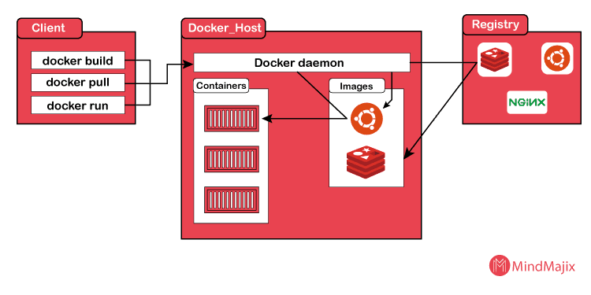

# Docker

**What is?** Docker is first-step software to create containerized cloud native apps. It has a few components that I will write about later.

**What isn’t?** Docker is not a way to build complex and enterprise level cloud native applications by itself. It can be used for single runtime used applications and less complicated applications.

## General Components of Docker

### Docker Engine

- **Docker Daemon (dockerd):** Background service that manages containers.
    
- **Docker CLI:** Bash cli for managing docker.
    
- **REST API:** Another way to manage docker, http based.


### Docker Objects

- **Containers:** Instead of downloading libraries, interpreters, compilers etc. and setting up configurations you can basically host them in a container that is isolated from operation system’s other parts.
    
- **Container Images:** Container images are prepared in advance containers that can be simply downloaded from a hub and executed with just 1 bash command. It is great for testing a software or making different versions of your service.
    
- **Layers:** Applications that built with docker compose are based on layers which means different images stacked at base image in a row.
    
- **Volumes:** Constant sized storage parts.
    
- **Networks:** Communication way of docker containers with each other and with WWW.
    
- **Docker Hub:** A huge registry you can download images from.
    

### Docker Tools & Utilities

- **Docker Compose:** Runtime for multi containerized apps.
    
- **Docker Swarm:** It sucks.
    
- **Docker Desktop:** A GUI to easily manage docker objects.

## How docker works
<figure>
    
    <figcaption>Note that image is an excerpt from <a target="_blank" href="https://mindmajix.com/what-is-docker-how-docker-works" >mindmajix.com</a>.</figcaption>
</figure>

### Container Isolation
**Working Principle**: // TO-DO
### Layers
**What is? (and Also Working Principle)**: The docker images based on a docker feature called layers, each layer is a set of immutable filesystems that are stacked on top of each other by priority, enabling container isolation. Layers can be shared across the images thus resource usage can be significantly lowered.

<details>
  <summary><b>Filesystem Structure of a Layer</b></summary>
  <ul>
    <li>Base OS, basic commands and package manager (like apt)</li>
    <li>Runtime and dependency manager</li>
    <li>Contains files that have application's dependency instructions such as package.json</li>
    <li>Application dependencies</li>
    <li>Application's code files</li>
  </ul>
</details>

<i>Notes: 
- It is good to try to minimize the number of layers because AUFS has a 127 layer limit. Also, each `RUN` instruction generates a new layer, so try to reduce its usage or combine multiple commands in a single `RUN`.
</i>

### The Union File System
> Open your eyes now because this part is critical. It is really has a important role in docker containers.

**Working Principle**: UnionFS basically merges multiple files and folders from seperate filesystems (called as branches in this situation) into one filesystem. The base filesystem will be assumed as combination of all branches, starting with the base layer and the other layers will be overlay each other by priority. 

## Building a Basic Container
### The `Dockerfile`,
**What is?** A file that contains steps to build a container.
#### **Getting Started**
Start with creating a folder and a file named "Dockerfile" inside it:
```bash
mkdir adnan_karacabey
cd adnan_karacabey
touch Dockerfile
```
After creating the Dockerfile, open it and start decorating your container. First of all you will need to specify a base image. In this example I will use my favorite distro Arch. You can find a list of base images [here](https://hub.docker.com/). You can do this with the "FROM" keyword:
```Dockerfile
FROM archlinux
RUN echo "w"
```

## The `Dockerfile` Instructions
- <details>
  <summary>The <code>FROM</code> Key</summary>
  <br/>

  **Description**: // TO-DO
  **Example**: // TO-DO
  </details>
- <details>
  <summary>The <code>RUN</code> Key</summary>
  <br/>

  **Description**: // TO-DO
  **Example**: // TO-DO
  </details>
- <details>
  <summary>The <code>COPY</code> Key</summary>
  <br/>

  **Description**: // TO-DO
  **Example**: // TO-DO
  </details>
- <details>
  <summary>The <code>RUN</code> Key</summary>
  <br/>

  **Description**: // TO-DO
  **Example**: // TO-DO
  </details>
- <details>
  <summary>The <code>ENTRYPOINT</code> Key</summary>
  <br/>

  **Description**: // TO-DO
  **Example**: // TO-DO
  </details>
## The Cheatsheet
### CLI Commands
- <details>
  <summary><code>docker run ?{OPTIONS} {IMAGE} ?{COMMAND} ?{ARGS OF COMMAND}</code>: Run a container from image.</summary>
  <br/>

  - OPTIONS (Optional): Put here what options would you like to use while running your container.
  - IMAGE: Name of your image.
  - COMMAND (Optional): The bash command you want to run in your container.
  - ARGS OF COMMAND (Optional): Arguments of your command.
  <br/>
  <details>
    <summary>Available options</summary>
    <ul>
      <li>
        <code>--add-host {host}:{ip}</code>: Bind a hostname to ip.
        <ul>
          <li>HOST: Hostname to bind.</li>
          <li>IP: IP to bind.</li>
        </ul>
      </p>
      <li><code>-a </code></li>
      <li><code>-c {INT}</code>: CPU shares allowed to this container. Default: 1024</li>
      <li><code>-d</code>: Detach container from your current bash. It will be runned in background.</li>
      <li><code>-e {ENV_VAR}</code>: Set an environment variable.</li>
      <li><code>-h {HOSTNAME}</code>: Set a hostname for your container.</li>
      <li><code>-i</code>: Interactive mode. It will open a bash in your container.</li>
      <li><code>-l "{NAME}={VALUE}"</code>: Basically adds a tag to your container to be able to find it later.</li>
      <li><code>-q</code></li>
      <li><code>-m {MEMORY}</code>: Set memory limit for your container.</li>
      <li><code>--name {CONTAINER_NAME}</code>: Set a name for your container.</li>
      <li><code>--network {NETWORK}</code>: Connect container to a network.</li>
      <li><code>-p {PORT}:{PORT}</code>: Bind a port to another port.</li>
      <li><code>-rm</code>: Remove container after it is stopped.</li>
      <li><code>-t {TIMEOUT}</code>: Set a timeout for your container.</li>
      <li><code>-u {USER}</code>: Set a user for your container.</li>
      <li><code>-v {PATH}:{PATH}</code>: Bind a path to another path.</li>
      <li><code>--volume {LIST}</code>: Bind mounts to your container.</li>
      <li><code>-w {PATH}</code>: Set a working directory for your container.
    </ul>
    <blockquote><b>Example:</b> TO DO</blockquote>
  </details>
- <details>
  <summary><code>docker ps</code><summary>
  </details>
- <details>
  <summary><code>docker inspect {CONTAINER_NAME}</code><summary></details>
- <details>
  <summary><code>docker diff {CONTAINER_NAME}</code><summary>
  </details>
- <details>
  <summary><code>docker logs {CONTAINER_NAME}</code><summary>
  </details>
- <details>
  <summary><code>docker rm {CONTAINER_NAME}</code><summary>
  </details>
- <details>
  <summary><code>docker build ?{OPTIONS} {IMAGE_NAME}</code><summary>
  </details>
- <details>


  <summary><code>docker commit {CONTAINER_NAME} {IMAGE_NAME}</code><summary>
  </details>